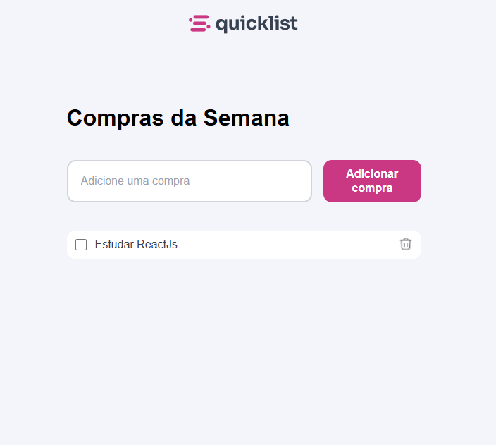

# 🛒 Lista de Compras

Este projeto é uma aplicação simples para gerenciar uma lista de compras, permitindo adicionar, remover e salvar itens utilizando **JavaScript** e **LocalStorage**.

---

### 🚀 Acesse o projeto:
🔗 [Lista de Compras - Clique aqui para acessar](#)

---

### 🔧 Tecnologias Utilizadas
- **JavaScript**: Manipulação da lista de compras e armazenamento local.
- **HTML & CSS**: Estrutura e estilização da interface.
- **LocalStorage**: Persistência dos dados mesmo após recarregar a página.

---

### ⚙️ Funcionalidades
- ✅ Adicionar itens à lista de compras.
- ✅ Remover itens da lista.
- ✅ Salvar automaticamente os itens no **LocalStorage**.
- ✅ Carregar a lista salva ao abrir a página.

---

### 🖼 Screenshots
#### Interface da aplicação

---

### 🌟 Melhorias Futuras
- 🔄 Adicionar a opção de editar itens.
- 📜 Implementar um histórico de compras.
- 🎨 Melhorias na interface do usuário.

---

### 📄 Licença
Este projeto está sob a licença MIT. Veja o arquivo [LICENSE](LICENSE) para mais detalhes.

---

### 👤 Autor
**Mathias Fuhr**  
- 🌐 [LinkedIn](https://www.linkedin.com/in/mathiasgilvanfuhr/)  
- 📧 mathiasgfuhr@gmail.com